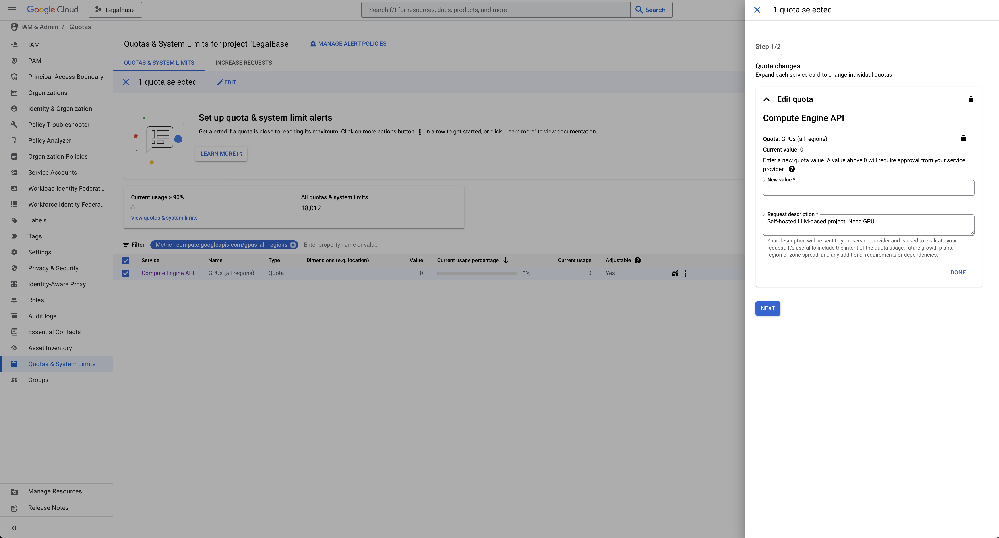

## NOTE: 

Right now the GCP provisioning scripts uses Devin's personal 1Password path, this ssh key can be changed to yours if someone else is deploying, just don't check it into the repo. 

## Prerequisites

Make sure Terraform, Ansible, and other things are installed on your machine. Scripts have been provided in `/local`.

## Description

This is a Terraform + Ansible configuration to setup the initial GCP project, enable services, deploy resources, etc.

The purpose is portability and reproducibility, should this project be moved to a different hosting platform or change ownership.

This configuration only needs to be run once, locally. 

## Quick Start 

First, all new projects have a quota limit of 0 for GPUs. You have to send a request to GCP to increase that quota (see [here](https://stackoverflow.com/questions/53415180/gcp-error-quota-gpus-all-regions-exceeded-limit-0-0-globally). This cannot be done in Terraform (see [here](https://stackoverflow.com/questions/63598319/how-to-increase-quota-on-gcp-using-terraform-module))




Then, initialize your Google Cloud CLI and create local authentication credentials ([?](https://cloud.google.com/docs/authentication/set-up-adc-local-dev-environment)):

```
gcloud init
gcloud auth application-default login
```

Generate the SSH private key that will be used to SSH in: 
```
./1_generate_key.sh
```

Now you can provision resources:

```
./2_provision_gcp.sh
```

To check the current state:

```
terraform show
```

After provisioning, you can then set up the VM using Ansible. Start with generating the inventory, then run the setup script.

```
./3_generate_inventory.sh
./4_setup_vm.sh
```

At the end of the night to save cost, you may opt to stop the vm (but not terminate). Likewise, you may want to start the vm the next morning. Helper scripts have been provided too:

```
./stop_vm.sh
./start_vm.sh
```

Note 1: The exact same resource may be unavailable the next day when you're trying to restart the VM. In that case, it's faster to reprovision your vm by running:

```
./2_provision_gcp.sh
```

Note 2: Your auth expires after some time, so if you see an error just login again:

```
gcloud auth application-default login
```

## First Time? 

Some basic concept explanations: 

### GCP 

#### GCP Hierarchy, Regions, and Zones 

So in the GCP hierarchy, at the top we have a `project`. A `project` can contain multiple `resources`. Additionally, it:

- Has a unique project id
- Linked to a billing account (along with settings to set quotas/limits)
- Manages what APIs/Services are enabled on this project 
- Manages IAM policies and permissions

Each resource is deployed/hosted in a specific location, which are defined in terms of `regions` and `zones`. 

Regions are larger areas consisting of multiple zones, like `us-west1`. 

Zones have high-bandwidth, low-latency network connections to other zones in the same region. They're usually written with a postfix like `us-west1-a/b/c/d`.

Different zones have different resource availability, even within the same region. For example, `us-west2-b` has GPU resources, but `us-west2-a` doesn't.

For certain applications, certain regions can sometimes be more suitable than other regions due to general availability of resources. 

For this project, we will select `us-central1` (Iowa) as our region.`us-west1` kept throwing resource availability errors due to GPUs being fully used.

The specific zone isn't very important, but biggest issue was again resource availability. Whatever we have in code right now is what worked at the time.

For more reading on regions and zones, see [here](https://cloud.google.com/compute/docs/regions-zones)

Typically, a project will be setup per environment, so you would have legalease-prod/legalease-dev, but in the name of cost-savings, we will only have one (prod) environment. All development should happen locally otherwise.

#### Google Compute Engine 

Since we aim to self-host most things in the name of cost-reduction and portability, we will mostly be using Google Compute Engine. 

We need a machine that has a GPU to host our LLM, and the cheapest of the bunch is an NVIDIA T4 at around $255.50/month.

This GPU is an additional cost to the base machine type, and the cheapest that supports this GPU is an `n1-standard-1` at $34.67/month.

There are some discounts applied to this, but the total cost comes down to around $204.12/month.

Image type is just whatever image/OS used to initialize the VM. 


### Terraform

Terraform is what you call Infrastructure-as-Code. 
